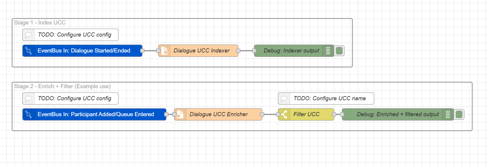

# EventBus UCC Enricher

## Table of Contents
- [Overview](#overview)
- [Flow Description](#flow-description)
- [How to Download and Import](#how-to-download-and-import)
- [Configuration After Import](#configuration-after-import)
- [Node Descriptions](#node-descriptions)
	- [Stage 1 - Dialogue UCC Indexer](#stage-1---dialogue-ucc-indexer)
		- [EventBus In: Dialogue Started/Ended](#eventbus-in-dialogue-startedended)
		- [Dialogue UCC Indexer Function](#dialogue-ucc-indexer-function)
	- [Stage 2 - Enrich + Filter](#stage-2---enrich--filter)
		- [EventBus In: Participant Added/Queue Entered](#eventbus-in-participant-addedqueue-entered)
		- [Dialogue UCC Enricher Function](#dialogue-ucc-enricher-function)
		- [Filter UCC Switch](#filter-ucc-switch)
		- [Debug Nodes](#debug-nodes)

## Overview
This flow listens to Dialogue Studio Event Bus events and enriches them with the UCC name (uccName) based on the dialogue context. It maintains an in-memory index of dialogueId → uccName when a dialogue starts, and then uses that index to enrich subsequent dialogue-related events that may not carry the UCC name themselves.

You can optionally filter enriched events for a specific UCC and route them to other flows, monitoring, or external integrations.

## Flow Description
- **Stage 1 - Dialogue UCC Indexer**
	- Listens for `DialogueStartedEvent` and `DialogueEndedEvent`.
	- On `DialogueStartedEvent`, stores a mapping from `dialogueId` to `uccName` in global Node-RED context.
	- On `DialogueEndedEvent`, removes the mapping for that `dialogueId`.
- **Stage 2 - Enrich + Filter**
	- Listens for `DialogueParticipantAddedEvent` and `DialogueQueueEnteredEvent`.
	- If these events do not contain `uccName`, it looks up the value in the global cache from Stage 1 and enriches the event.
	- Optionally filters the enriched events by a specific `uccName` (example: `ucc-name-example`).
	- Outputs enriched (and optionally filtered) events for further processing.

This flow is useful when some Event Bus events lack the UCC name but you still need to route, filter, or monitor them based on UCC.

## How to Download and Import
1. Use the green **Download Code** button at the top right of the repository home.
2. Alternatively, click on the `.json` file, then click **Raw** at the top right, and copy the content using `Ctrl+A` and `Ctrl+C`.
3. Open Dialogue Studio and click the hamburger menu at the top right.
4. Choose **Import**, then paste the copied content or select the downloaded file.

## Configuration After Import
1. **Configure Event Bus connection** in both EventBus In nodes:
	 - Open the **EventBus In: Dialogue Started/Ended** node and set the appropriate Event Bus configuration (server/connection details as used in your environment).
	 - Open the **EventBus In: Participant Added/Queue Entered** node and use the same Event Bus configuration.
2. **Configure UCC name filter** (optional):
	 - Open the **Filter UCC** switch node.
	 - Replace `ucc-name-example` with the actual `uccName` you want to monitor or route.
3. **Connect the output**:
	 - The enriched and filtered events are sent to the **Debug: Enriched + filtered output** node by default.
	 - Replace or extend this connection with your own processing nodes (e.g., HTTP, database, Event Bus out, monitoring).

## Node Descriptions

### Stage 1 - Dialogue UCC Indexer

#### EventBus In: Dialogue Started/Ended
- Type: Event Bus In (any-red-event-bus).
- Listens for `DialogueStartedEvent` and `DialogueEndedEvent`.
- Passes events to the **Dialogue UCC Indexer Function** node.

#### Dialogue UCC Indexer Function
- Type: function node.
- Purpose:
	- Maintain a simple in-memory map from `dialogueId` to `uccName` using global context.
- Behavior:
	- On `DialogueStartedEvent` with a `uccName`:
		- Stores `global["dlgUcc:<dialogueId>"] = { uccName }`.
	- On `DialogueEndedEvent`:
		- Clears the mapping for that `dialogueId`.
	- On any other event with a `dialogueId` and `uccName`:
		- Refreshes the stored `uccName` for that `dialogueId`.
- Output:
	- Forwards the original message downstream (and to the debug node) unchanged, after updating the cache.

### Stage 2 - Enrich + Filter

#### EventBus In: Participant Added/Queue Entered
- Type: Event Bus In (any-red-event-bus).
- Listens for `DialogueParticipantAddedEvent` and `DialogueQueueEnteredEvent`.
- Sends incoming events to the **Dialogue UCC Enricher Function** node.

#### Dialogue UCC Enricher Function
- Type: function node.
- Purpose:
	- Ensure `msg.payload.event.uccName` is present for dialogue-scoped events by looking it up from the global cache.
- Behavior:
	- If the event already has `uccName`, it passes the message through unchanged.
	- Otherwise, it looks up `global["dlgUcc:<dialogueId>"]`.
	- If a cached `uccName` is found, it creates a new `msg.payload.event` object with `uccName` added.
	- If no cached value is found, it passes the message through unchanged.
- Output:
	- Enriched message (when `uccName` is found) or original message (when it is not).

#### Filter UCC Switch
- Type: switch node.
- Property: `msg.payload.event.uccName`.
- Behavior:
	- Only allows messages where `msg.payload.event.uccName` equals the configured UCC name (default example: `ucc-name-example`).
- Usage:
	- Change the comparison value to the UCC you want to capture.
	- Connect the output to any downstream processing node(s).

#### Debug Nodes
- **Debug: Indexer output**
	- Shows the output of the **Dialogue UCC Indexer Function** for troubleshooting and verification.
- **Debug: Enriched + filtered output**
	- Shows the final enriched (and filtered) events.
	- Use this to confirm that `uccName` is being correctly added and that your filter is working.